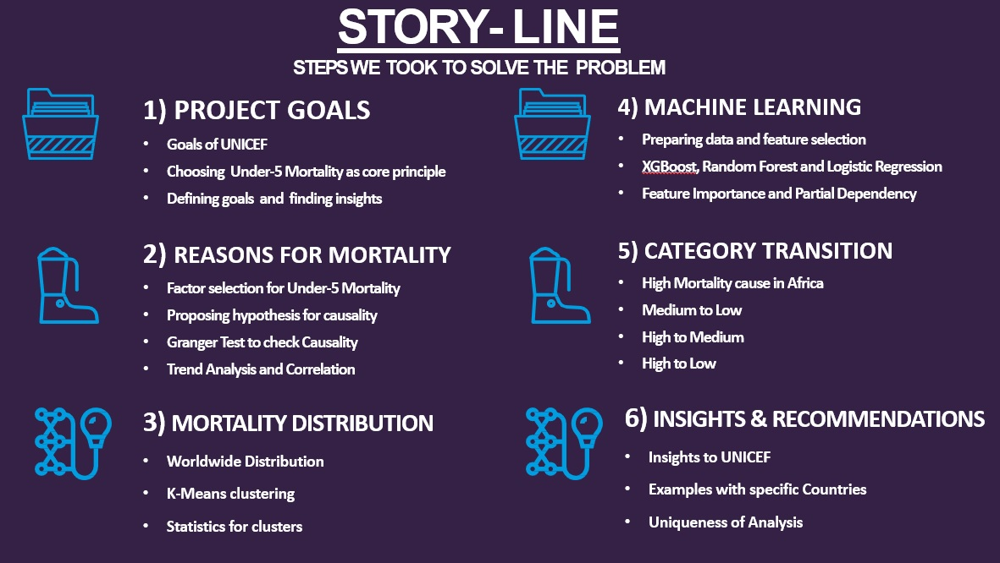
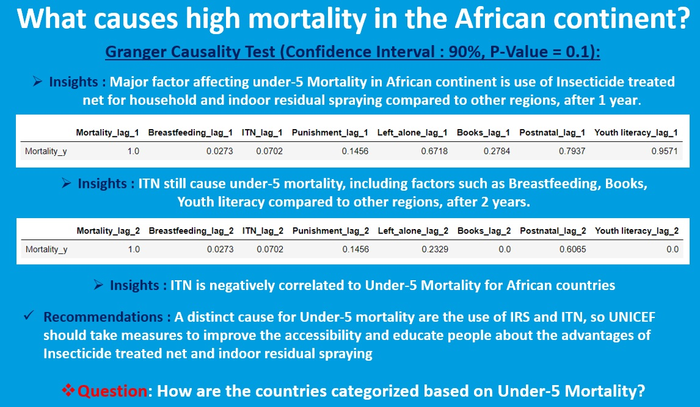
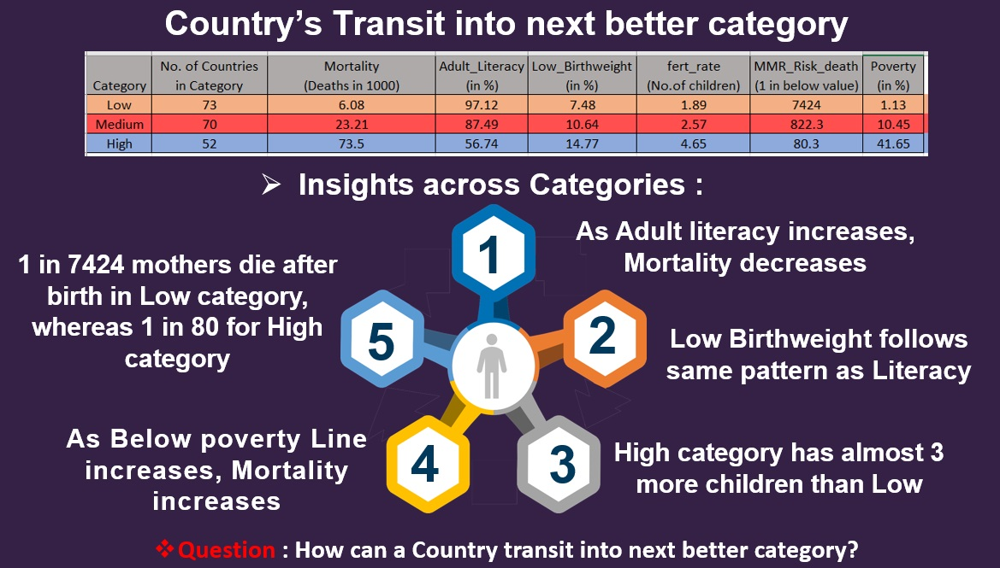
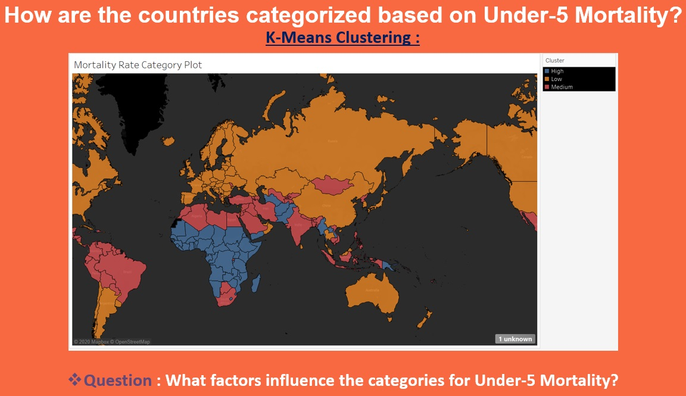
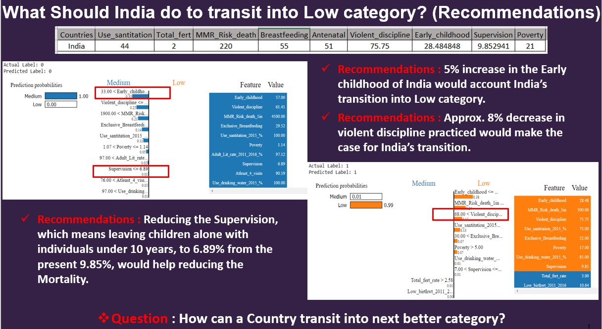

# UNICEF-Mortality-rate-analysis (IAS Hackathon)

Find Factors Causing Under 5 Mortality, Trend Analysis and Recommendations for Reducing Under-5 Mortality Rate at Country level.
You can view the entire project explanation on [YouTube](https://www.youtube.com/watch?v=Pl7aWUykvvE&t=535s).


## Table of contents

* [General info](#general-info)
* [Screenshots](#screenshots)
* [Technologies and Tools](#technologies-and-tools)
* [Code Examples](#code-examples)
* [Status](#status)
* [Contact](#contact)

## General info

Questions :
1. Identify at least 5 difference indicators and connect them to present a hypothesis. 
2. Identify the trends for any one of the categories and identify the causal factors. 
3. Present at least 5 recommendations to improve the quality of life of the kids. 

Major steps involved to solve problems were as follow : 

* STEP: 1 - Data Cleaning and Scrapping
* STEP: 2 - Granger Causality Test
* STEP: 3 - Trend Series Analysis 
* STEP: 4 - K-Means Clustering
* STEP: 5 - Multiclass Classification ML 
* STEP: 6 - Using Skater for interpretations
* STEP: 7 - Providing Recommendations

## Screenshots







**The entire explanation of the project can be found on [YouTube](https://www.youtube.com/watch?v=Pl7aWUykvvE&t=535s).**

## Technologies and Tools
* Python 
* Tableau
* Scikit-learn
* skater
* ELI5
* SHAP
* Time Series Analysis
* K-Means clustering
* Granger Casuality Test
* Model Interpretation

## Code Examples

````
# K-Means Clustering

from sklearn.cluster import KMeans
# fitting multiple k-means algorithms and storing the values in an empty list
SSE = []
for cluster in range(1,20):
    kmeans = KMeans(n_jobs = -1, n_clusters = cluster, init='k-means++')
    kmeans.fit(data_scaled)
    SSE.append(kmeans.inertia_)
# converting the results into a dataframe and plotting them
frame = pd.DataFrame({'Cluster':range(1,20), 'SSE':SSE})
plt.figure(figsize=(12,6))
plt.plot(frame['Cluster'], frame['SSE'], marker='o')
plt.xlabel('Number of clusters')
plt.ylabel('Inertia')
````

````
# Granger Casuality Test
from statsmodels.tsa.stattools import grangercausalitytests
maxlag=2
test = 'ssr_chi2test'
def grangers_causation_matrix(data, variables, test='ssr_chi2test', verbose=False):        
    df = pd.DataFrame(np.zeros((len(variables), len(variables))), columns=variables, index=variables)
    for c in df.columns:
        for r in df.index:
            test_result = grangercausalitytests(data[[r, c]], maxlag=maxlag, verbose=False)
            p_values = [round(test_result[i+1][0][test][1],4) for i in range(maxlag)]
            if verbose: print(f'Y = {r}, X = {c}, P Values = {p_values}')
            min_p_value = np.min(p_values)
            df.loc[r, c] = min_p_value
    df.columns = [var + '_lag_2' for var in variables]
    df.index = [var + '_y' for var in variables]
    return df 
````


## Status
Project is: _finished_. Our team was the winner of the IAS Hackaton 2020.

## Contact
Created by me with my teammates [Vignesh Vishwanathan](https://github.com/vigviswa), Sanya Tandon and [Shriya Agrawal](https://github.com/shriyaagarwal).

If you loved what you read here and feel like we can collaborate to produce some exciting stuff, or if you
just want to shoot a question, please feel free to connect with me on 
<a href="mailto:manishshukla.ms18@gmail.com">email</a> or 
<a href="https://www.linkedin.com/in/manishshukla-ms/" target="_blank">LinkedIn</a>
